    library(rethinking)
    library(glue)
    library(tidyverse)

Chapter 4: Geocentric Models
============================

#### Text-book code for Gaussian modelling of height.

    data("Howell1")
    d <- Howell1
    d2 <- d %>% filter(age >= 18)
    mu.list <- seq(from=150, to=160, length.out = 100)
    sigma.list <- seq(from = 7, to = 9, length.out = 100)
    post <- expand.grid(mu = mu.list, sigma = sigma.list)

    # calculate likelihood from grid of values 
    post$LL <- sapply(1:nrow(post), function(x){
      sum(dnorm(d2$height, post$mu[x], post$sigma[x], log = TRUE))
    })

    # evaluate numerator as likelihood combined with prior 
    post$prod <- post$LL + dnorm(post$mu, 170, 20, TRUE) + dunif(post$sigma, 0, 50, TRUE)

    # normalize by maximum 
    post$prob <- exp(post$prod - max(post$prod))

    print("Contour plots")

    ## [1] "Contour plots"

    contour_xyz(post$mu, post$sigma, post$prob)

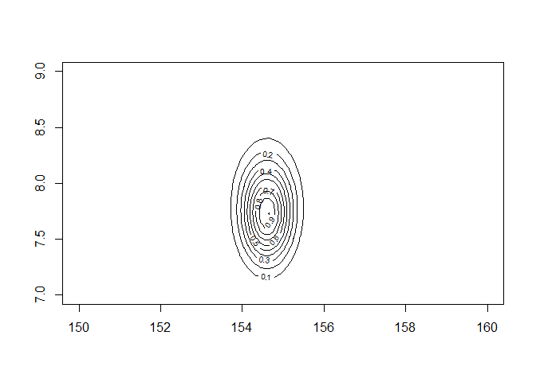

    print("Heatmap")

    ## [1] "Heatmap"

    image_xyz(post$mu, post$sigma, post$prob)

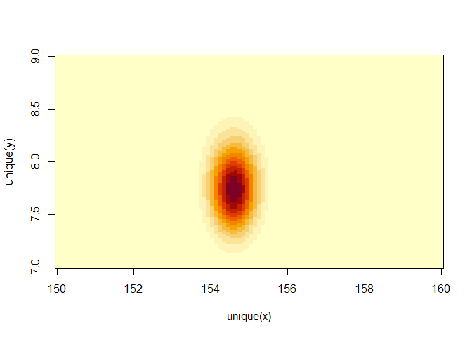 \#\#\#\#
Sampling from the posterior

    # sampling rows based on posterior 
    sample.rows <- sample(1:nrow(post), size = 1e4, replace = T, prob = post$prob)

    # retrieve parameter values 
    sample.mu <- post$mu[sample.rows]
    sample.sigma <- post$sigma[sample.rows]

    plot(sample.mu, sample.sigma, cex = 0.5, pch = 16, col = col.alpha(rangi2,0.1))

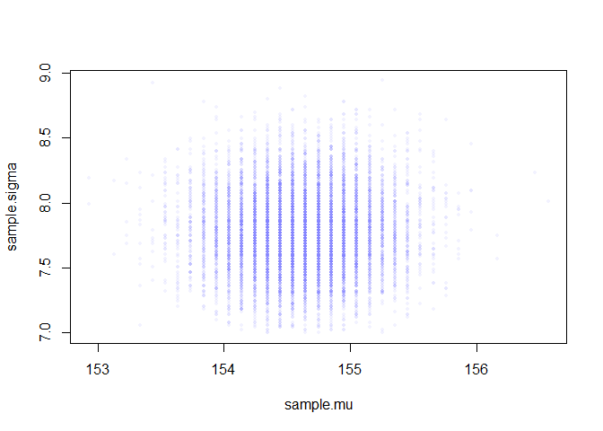

    # Marginal distribution
    dens(sample.mu)

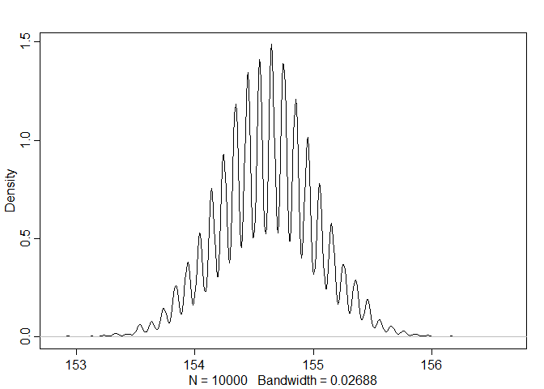

    dens(sample.sigma)

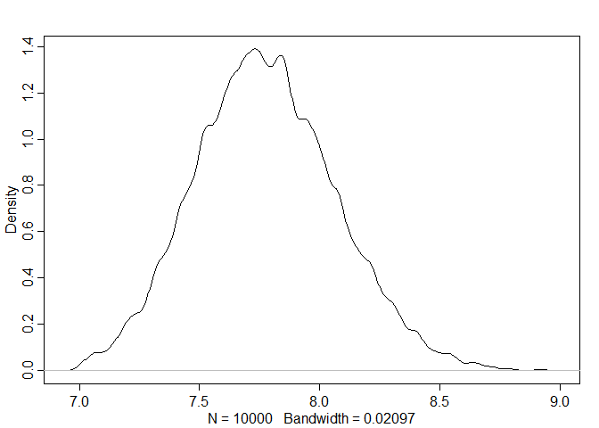

    PI(sample.mu)

    ##       5%      94% 
    ## 153.9394 155.2525

    PI(sample.sigma)

    ##       5%      94% 
    ## 7.323232 8.272727

#### Using the quadratic approximation

    flist <- alist(
      height ~ dnorm(mu, sigma),
      mu ~ dnorm(178,20),
      sigma ~ dunif(0,50)
    )

    m4.1 <- quap(flist, data = d2)
    precis(m4.1)

    ##             mean        sd       5.5%      94.5%
    ## mu    154.606696 0.4119103 153.948384 155.265008
    ## sigma   7.729749 0.2912368   7.264296   8.195202

`quap` estimates posterior distribution by approximation. It needs a
start point to start the gradient procedure, which will be chosen at
random from the prior if start values are not specified. Use `alist`
when defining a list of formulas because alist does not evaluate terms
in the list.

#### Using quadratic approximation with a more informative prior

    m4.2 <- quap(
      alist(
        height ~ dnorm(mu, sigma),
        mu ~ dnorm(178, 0.1),
        sigma ~ dunif(0,50)
      ), data = d2
    )

    precis(m4.2)

    ##            mean        sd      5.5%     94.5%
    ## mu    177.86375 0.1002354 177.70356 178.02395
    ## sigma  24.51756 0.9289228  23.03296  26.00215

#### Sampling from quap

    post <- extract.samples(m4.1, n = 1e4)
    precis(post)

    ##             mean        sd       5.5%      94.5%
    ## mu    154.603166 0.4132842 153.948728 155.264238
    ## sigma   7.730914 0.2898533   7.265039   8.196802
    ##                                                                                      histogram
    ## mu                                    <U+2581><U+2581><U+2585><U+2587><U+2582><U+2581><U+2581>
    ## sigma <U+2581><U+2581><U+2581><U+2582><U+2585><U+2587><U+2585><U+2583><U+2581><U+2581><U+2581>

#### Linear prediction

    plot(d2$height ~ d2$weight)

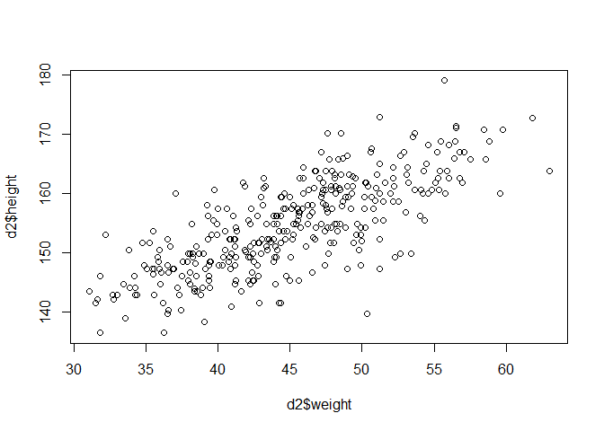
Simulating to get the prior.

    N <- 100
    a <- rnorm(N, 178, 20)
    b <- rnorm(N, 0, 10)
    b2 <- rlnorm(N, 0, 1)
    xbar <- mean(d2$weight)
    print("Getting the normal prior")

    ## [1] "Getting the normal prior"

    plot(NULL, xlim = range(d2$weight), ylim = c(-100,400))
    for (i in 1:N){
      curve(a[i] + b[i]*(x - xbar), from = min(d2$weight), 
            to=max(d2$weight),add = TRUE)
    }

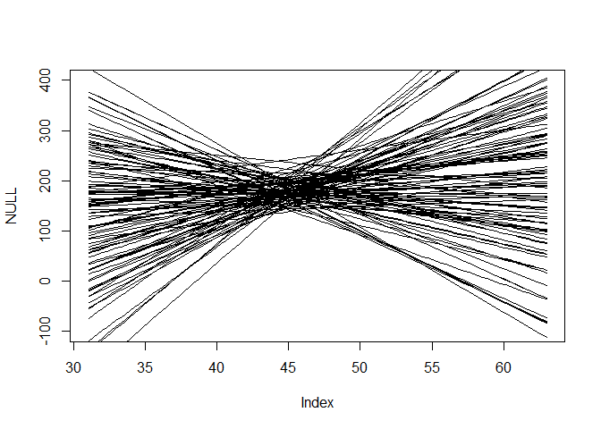

    print("Getting the log-normal prior")

    ## [1] "Getting the log-normal prior"

    plot(NULL, xlim = range(d2$weight), ylim = c(-100,400))
    for (i in 1:N){
      curve(a[i] + b2[i]*(x - xbar), from = min(d2$weight), 
            to=max(d2$weight),add = TRUE)
    }

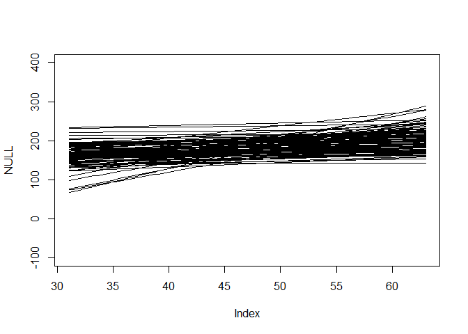

We fuss about priors for two reasons:  
1. There are many analyses in which no amount of data makes the prior
irrelevant. Non Bayesian methods also depend on such structural
assumptions and are no better off.  
2. Second, thinking about priors helps us develop better models, maybe
even eventually going beyond geocentricism.

**Rethinking: What is the correct prior?** People often assume that
there is a uniquely correct prior, which is wrong. Priors can be wrong
in the same way that a hammer can be wrong for building a table. There
exists guidelines to chose priors. Priors encode data and information
before seeing data. Priors allow us to see consequences of beginning
with different information. We can use priors to discourage certain
parameter values such as negative associations between height and
weight. When we don’t know that much, we still now some information
about the plausible range of values.

**Rethinking: Prior predictive simulation and p-hacking** If we choose
to evaluate our choice of priors on observed data, that’s cheating. The
procedure performed is to try to choose priors based on pre-data
knowledge. We’re judging our choice of prior on general facts, not the
sample.

Back to our regression model of weight and height which we have as:
*h**i* ∼ *N**o**r**m**a**l*(*μ**i*, *σ*)
*μ**i* = *α* + *β*(*x**i* − *x̄*)
*α* ∼ *N**o**r**m**a**l*(178, 20)
*β* ∼ *L**o**g* − *N**o**r**m**a**l*(0, 1)
*σ* ∼ *U**n**i**f**o**r**m*(0, 50)
We can encode this to our model

    m4.3 <- quap(
      alist(
        height ~ dnorm(mu, sigma),
        mu <- a + b*(weight - xbar),
        a ~ dnorm(178,20),
        b ~ dlnorm(0,1),
        sigma ~ dunif(0,50)
      ), data = d2
    )

#### Interpreting the posterior distribution

We can learn about our model results either via tables or via simulation
plotting. Tables aren’t too great, however, at understanding complex
models. In this book we’re going to focus on plotting the posterior
distributions and posterior predictions.  
**Rethinking: What do parameters mean?** The perspective of this book
is: \*Posterior probabilities of parameter values describe the relative
compatiability of different states of the world with the data, according
to the model.

First, let’s observe a table of marginals

    precis(m4.3)

    ##              mean         sd        5.5%       94.5%
    ## a     154.6013226 0.27031020 154.1693147 155.0333305
    ## b       0.9032844 0.04192403   0.8362817   0.9702871
    ## sigma   5.0719287 0.19115928   4.7664192   5.3774381

    pairs(m4.3)

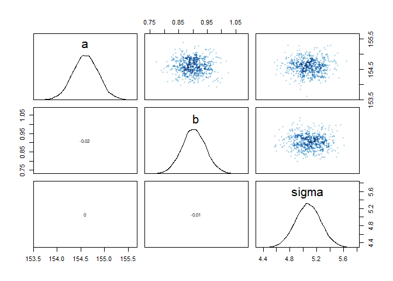

Plotting the posterior distribution against the data can provide an
informal check on assumptions. But more importantly it provides a way to
interpret the posterior, especially as models get complicated with
interactions and non-linear terms.

    plot(height ~ weight, data = d2, col = rangi2)
    post <- extract.samples(m4.3)
    a_map <- mean(post$a)
    b_map <- mean(post$b)
    curve(a_map + b_map*(x - xbar), add = T)

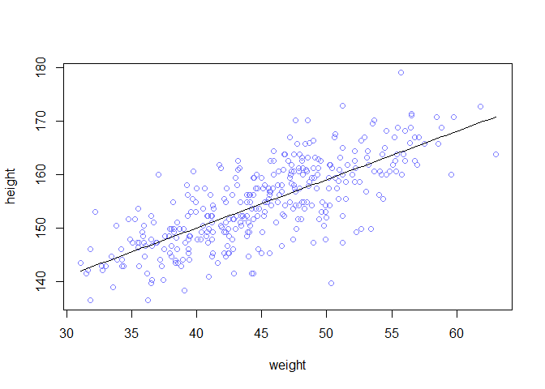

The line we just draw is the posterior mean line and does not capture
the uncertainty of the estimates. We can do so by plotting multiple
regression lines.

    post <- extract.samples(m4.3, n=100)
    plot(d2$weight, d2$height, xlim = range(d2$weight), ylim = range(d2$height), col = rangi2, 
         xlab = "Weight", ylab = "Height")
    for (i in 1:nrow(post)){
      curve(post$a[i] + post$b[i]*(x - mean(d2$weight)), col = col.alpha("black", 0.3), add = T)
    }

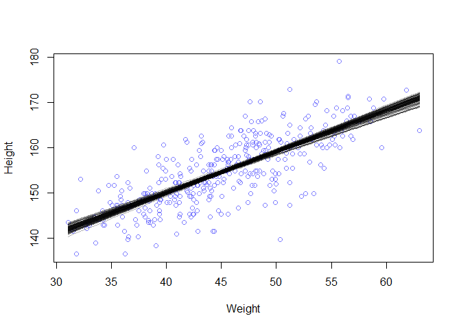

The uncertainty decreases as we increase the sample size. Since *μ* is a
combination of random variables with distributions, *μ* has a
distribution. For every value of *x* weight, we can get all possible
values of *μ* as a joint distribution of values of *α* and *β*. This
distribution incorporates both the individual variabilities of *α* and
*β* as well as any correlation between the variables (joint Gaussian
distribution). We can construct an interval for values of height at each
values of weight according to our posterior distribution. If we do so
for every point of weight in the sample, we can conduct a confidence
band for our regression model.

    weight.seq <- seq(25, 70, 1)
    mu <- link(m4.3, data = data.frame(weight = weight.seq))
    str(mu) # This samples from the posterior of height for each value in weight.seq from the model 

    ##  num [1:1000, 1:46] 137 137 135 137 137 ...

    plot(height ~ weight, d2, type = "n")
    for(i in 1:100){
      points(weight.seq, mu[i,], pch = 16, col = col.alpha(rangi2,0.1))
    }

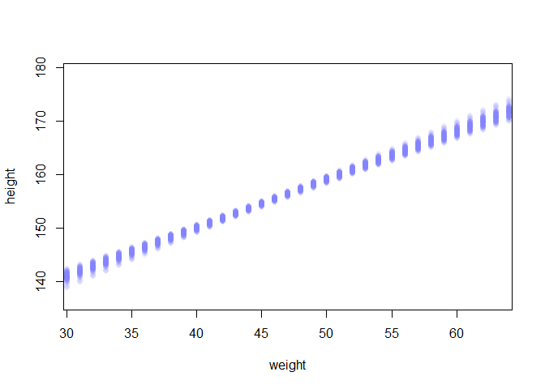

We can summarize the posterior distribution as interval estimates and
the mean

    mu.mean <- apply(mu, 2, mean)
    mu.PI <- apply(mu, 2, PI, prob = 0.89)
    plot(height~weight, data = d2, col = col.alpha(rangi2, 0.5))
    lines(weight.seq, mu.mean)
    shade(mu.PI, weight.seq)

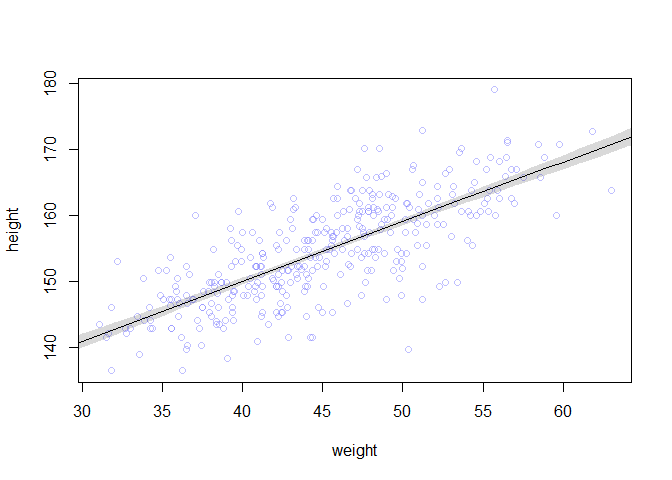

These intervals are great but they’re very tight around the posterior
mean (MAP). This is because the inferences are always conditional on the
model. Even bad models can have tight compatibility intervals. In other
words, this line can be thought of as “conditional on the assumption
that height and weight are linearly related by a straight line, then
this is the most plausible line”

Some ways we can generate predictions and posterior from a fitted
model:  
(1) Use a function (in this case `link`) to generate distributions of
posterior values for your parameter *μ* for each combination of values
from your predictors of interest (in this case, weight).  
(2) Use summary functions like `mean` and `PI` to find averages and
lower and upper bounds for *μ* for each value of the predictor
variable  
(3) Use plotting functionality to draw lines and intervals with respect
to the real data.

#### Prediction intervals

The goal of the model in the prediction sense is not to estimate the
average height but more specific heights. The way to do it is: for any
unique weight value, you can sample from a Gaussian distribution with
the correct mean for that weight, using the value of sigma sampled from
the sample posterior distribution. If you do this for every sample from
the posterior and every weight value, you can get estimates that
incorporates both the uncertainty of the Gaussian distribution, as well
as the uncertainty of the posterior.

    sim.height <- sim(m4.3, data = list(weight = weight.seq))
    height.PI <- apply(sim.height, 2, PI, prob = 0.89)
    mu.HPDI <- apply(mu, 2, HPDI, prob = 0.89)
    plot(height ~ weight, d2, col = col.alpha(rangi2, 0.5))
    lines(weight.seq, mu.mean)
    shade(mu.HPDI, weight.seq)
    shade(height.PI, weight.seq)

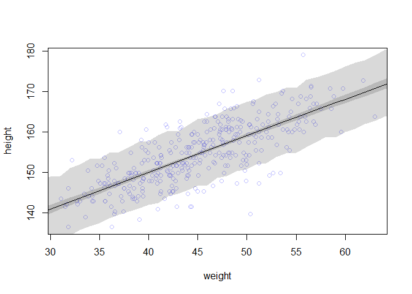

### 4.5 Curve from lines

Here we consider two methods to build curves into our regression. The
first is polynomial regression and the second is b-splines.  
\#\#\#\# Polynomial regression  
Polynomial regression uses powers of a variable (such as cubes and
squares) as extra predictors to build in curvature to the association
function.  
Before we start we should start standardizing our variables, which is a
common approach. This will ensure that we don’t have numerical glitches
due to large (or small) numbers, as squares and cubes of variables can
be very huge. This should be **default** behavior. Let’s define a
parabola model on the height vs weight example that we see:  
\[ h\_i Normal(\_i, ) \\

\_i = + \_1 x\_i + \_2 x\_i^2 \\ Normal(178,20) \\ \_1 LogNormal(0,1) \\
\_2 Normal(0,1) \\ Uniform(0,50) \\ \] Let’s build a model using this
new formulation

    d$weight_s <- (d$weight - mean(d$weight))/sd(d$weight)

    d$weight_s2 <- d$weight_s^2

    m4.5 <- quap(
      alist(
        height ~ dnorm(mu, sigma),
        mu <- a + b1*weight_s + b2*weight_s2,
        a ~ dnorm(178,20),
        b1 ~ dlnorm(0,1),
        b2 ~ dnorm(0,1),
        sigma ~ dunif(0,50)
      ), data = d
    )
    precis(m4.5)

    ##             mean        sd       5.5%      94.5%
    ## a     146.057417 0.3689755 145.467723 146.647111
    ## b1     21.733061 0.2888890  21.271360  22.194761
    ## b2     -7.803269 0.2741838  -8.241468  -7.365070
    ## sigma   5.774474 0.1764651   5.492449   6.056499

It’s difficult to interpret these polynomial models. *β*1 and
*β*2 are square and linear components of the regression, and
*α* is still the intercept but we still don’t know what it means. Since
this is a polynomial regression, it also doesn’t guarantee that we’re
regressing to the mean of heights either. Let’s plot these things out.

    weight_seq <- seq(from = -2.2, 2, length.out = 30)
    pred_dat <- list(weight_s = weight_seq, weight_s2 = weight_seq^2)
    mu <- link(m4.5, data = pred_dat)
    mu.mean <- apply(mu,2,mean)
    mu.HPDI <- apply(mu, 2, HPDI, prob = 0.89)
    height_sim <- sim(m4.5, data = pred_dat)
    height.PI <- apply(height_sim, 2, PI, prob = 0.89)

    plot(height ~ weight_s, d, col = col.alpha(rangi2, 0.5))
    lines(weight_seq,   mu.mean)
    shade(mu.HPDI, weight_seq)
    shade(height.PI, weight_seq)

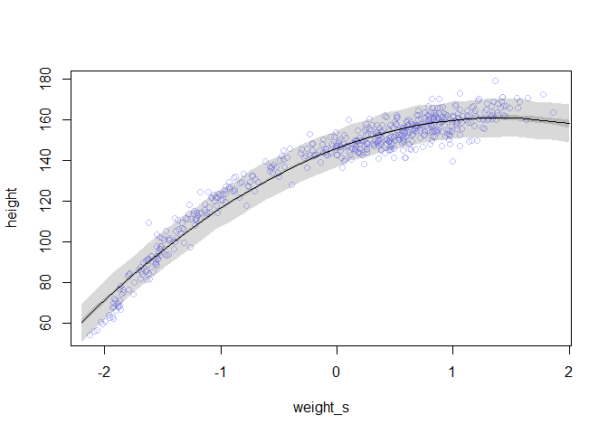 We can
add a third degree polynomial term to get a cubic model. However, these
models don’t really have explanations as to what they mean, and can
actually lead to overfitting.  
**Rethinking: Linear, additive, funky** These models are still linear
models even though they are cubic and square terms with non-straight
curve. The word “linear” mean different things in different contexts. In
this context, the word “linear” here means that *μ**i* is a
linear function of any single parameter. In other words,
*μ**i* is linear with respect to *x* and *x*2
individually, but the combination of terms makes it non-linear.

#### Splines

The second way to introduce a curve is through a spline. The word
*spline* is a smooth function built out of smaller component piece-wise
linear functions. The **B-Spline** we’ll look at here is commonplace.
**B** here stands for “basis”, which means “component”.

    data(cherry_blossoms)
    d <- cherry_blossoms
    plot(doy ~ year, data = d)

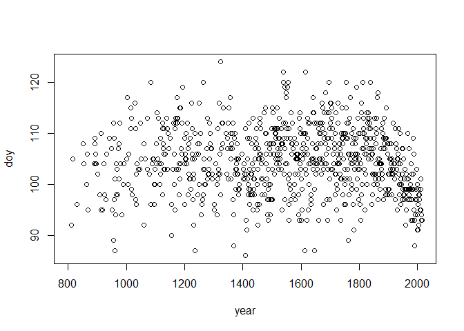 There
are many ways you can construct basis functions. Some general ideas:  
(1) First, you define “knots” in your data where basis functions
completely transform from one basis to another.  
(2) Then, you can define how many basis you can choose, depends usually
on the number of knots.  
(3) The basis functions are supposed to smooth out transitions between
knotted sections, and generally no more than two basis functions have an
“influence” (non-zero weight) for any point in the predictor variable.
This gives splines a “local” effect where locally only one or two
parameter has an effect, as supposed to polynomial regression where the
slope has an impact across the entire regression.  
(4) You can increase the complexity and flexibility of the model by
adding more knots or even use higher degree polynomials.

With our spline model for cherry blossom data, first we can define some
knots.

    d2 <- d[complete.cases(d$doy), ]
    num_knots <- 15
    knot_list <- quantile(d2$year, probs = seq(0,1, length.out = num_knots))
    knot_list

    ##        0% 7.142857% 14.28571% 21.42857% 28.57143% 35.71429% 42.85714%       50% 
    ##       812      1036      1174      1269      1377      1454      1518      1583 
    ## 57.14286% 64.28571% 71.42857% 78.57143% 85.71429% 92.85714%      100% 
    ##      1650      1714      1774      1833      1893      1956      2015

Next we can construct the polynomial degree, which is the number of
parameters interacting at a given time. Degree of 1 means that only 2
parameters can interact at a given time (e.g. basis 1 and 2), degree of
2 means 3 parameters can i nteract at a given time, etc. Let’s choose
the cubic model in this instance.

    library(splines)
    basis <- bs(d2$year, knots = knot_list[-c(1, num_knots)], degree = 3, intercept = T) # remove the edges 
    plot(NULL, xlim=range(d2$year), ylim = c(0,1), xlab = "year", ylab = "basis")
    for (i in seq(ncol(basis))){
      lines(d2$year, basis[,i])
    }

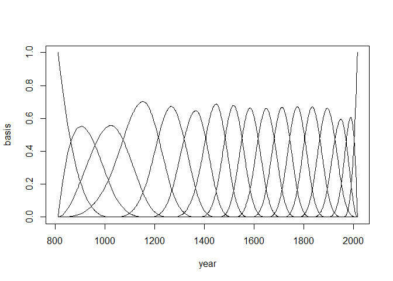

Let’s define our model using mathematical form. The model is still the
linear regression, and the `bs` function already did the hard work by
estimating all the synthetic basis variables.  
$$
  D\_i \\sim Normal(\\mu\_i, \\sigma) \\\\
  \\mu\_i = \\alpha + \\sum\_i^k w\_kB\_{k,i}\\\\
  \\alpha \\sim Normal(100,10),
  \\w\_j \\sim Normal(0,10),
  \\sigma \\sim Exponential(1)
$$
The priors on *w* influence how smooth (squiggly) the splines are. We
are also using an exponential distribution as a prior. This distribution
is good for things like scale parameters that have to be positive.

    m4.7 <- quap(
      alist(
        D ~ dnorm(mu, sigma),
        mu <- a + B %*% w,
        w ~ dnorm(0,10),
        a ~ dnorm(100,10),
        sigma ~ dexp(1)
      ), data = list(D = d2$doy, B = basis), start = list(w = rep(0, ncol(basis)))
    )
